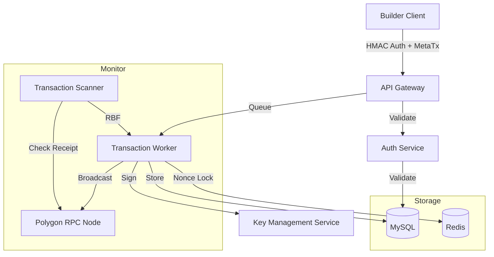

# Relayer Service 技术设计文档 (TDD)

## 1. 架构设计



## 2. 核心组件设计

### 2.1 认证服务 (Auth Service)
**职责**：
- 验证 Builder HMAC 签名
- 验证 API Key 有效性
- 验证时间戳（防止重放攻击）
- 管理 Builder 凭证

**实现**：
```go
type AuthService interface {
    ValidateBuilderAuth(ctx context.Context, req *AuthRequest) (*Builder, error)
    BuildHMACSignature(secret string, timestamp int64, method, path, body string) string
}
```

### 2.2 交易执行器 (Transaction Executor)
**职责**：
- 验证用户签名
- 验证目标合约白名单
- 估算 Gas Limit
- 选择 Operator Wallet
- 签名并广播交易

**实现**：
```go
type TransactionExecutor interface {
    Execute(ctx context.Context, tx *Transaction) (*TransactionResult, error)
    EstimateGas(ctx context.Context, tx *Transaction) (uint64, error)
    SelectOperator() (*Operator, error)
}
```

### 2.3 Nonce 管理器 (Nonce Manager)
**职责**：
- 管理每个 Operator 的 Nonce
- 使用 Redis 实现串行化队列
- 防止 Nonce 冲突

**实现**：
```go
type NonceManager interface {
    AcquireNonce(ctx context.Context, operator string) (uint64, error)
    ReleaseNonce(ctx context.Context, operator string, nonce uint64) error
    GetPendingNonce(ctx context.Context, operator string) (uint64, error)
}
```

### 2.4 交易监控器 (Transaction Monitor)
**职责**：
- 监控 Pending 交易
- 实现 RBF（Replace By Fee）
- 处理交易超时

**实现**：
```go
type TransactionMonitor interface {
    Start(ctx context.Context) error
    MonitorPending(ctx context.Context) error
    ReplaceByFee(ctx context.Context, tx *Transaction) error
}
```

## 3. 关键难点：Nonce 管理

### 3.1 问题描述
以太坊要求每个账号的 Nonce 必须严格递增。
- **问题**: 如果并发发送 10 笔交易，Nonce 分别是 100-109。如果 100 卡住，101-109 都不会被打包。

### 3.2 解决方案

#### 方案 1：Redis 队列串行化（推荐）
- 使用 **Redis List** 作为一个内存互斥锁/队列
- 严格串行化同一个 Operator 地址的发送操作
- 实现：
  ```go
  // 获取 Nonce
  nonce, err := redis.LPush(ctx, "nonce:queue:"+operator, txID)
  // 等待前一个交易完成
  // 发送交易
  // 释放 Nonce
  redis.RPop(ctx, "nonce:queue:"+operator)
  ```

#### 方案 2：Operator 地址池
- 维护多个 Operator 地址池 (Address Pool)
- 轮询使用，提高并发度
- 每个 Operator 独立管理 Nonce

#### 方案 3：混合方案（最佳）
- 使用多个 Operator 地址池
- 每个 Operator 使用 Redis 队列串行化
- 提高整体并发度

## 4. 数据模型

### 4.1 Transactions（交易表）
```sql
CREATE TABLE transactions (
    id VARCHAR(36) PRIMARY KEY,
    task_id VARCHAR(36) UNIQUE NOT NULL,
    tx_hash VARCHAR(66) UNIQUE,
    builder_api_key VARCHAR(255) NOT NULL,
    from_address VARCHAR(42) NOT NULL,  -- Operator address
    to_address VARCHAR(42) NOT NULL,    -- Target contract
    target_contract VARCHAR(42) NOT NULL,
    transaction_type VARCHAR(50) NOT NULL,
    data TEXT NOT NULL,
    value VARCHAR(78) NOT NULL,
    nonce BIGINT NOT NULL,
    gas_limit BIGINT NOT NULL,
    gas_price VARCHAR(78) NOT NULL,
    status VARCHAR(20) NOT NULL,  -- PENDING, MINED, FAILED, REPLACED
    block_number BIGINT,
    gas_used BIGINT,
    created_at TIMESTAMP NOT NULL,
    updated_at TIMESTAMP NOT NULL,
    INDEX idx_tx_hash (tx_hash),
    INDEX idx_builder_api_key (builder_api_key),
    INDEX idx_status (status),
    INDEX idx_created_at (created_at)
);
```

### 4.2 Builders（Builder 表）
```sql
CREATE TABLE builders (
    id BIGINT PRIMARY KEY AUTO_INCREMENT,
    api_key VARCHAR(255) UNIQUE NOT NULL,
    secret_hash VARCHAR(255) NOT NULL,  -- 加密存储
    passphrase_hash VARCHAR(255) NOT NULL,  -- 加密存储
    name VARCHAR(255),
    status VARCHAR(20) NOT NULL,  -- ACTIVE, SUSPENDED, REVOKED
    created_at TIMESTAMP NOT NULL,
    updated_at TIMESTAMP NOT NULL,
    INDEX idx_api_key (api_key),
    INDEX idx_status (status)
);
```

### 4.3 Builder Fees（Builder 费用统计表）
```sql
CREATE TABLE builder_fees (
    id BIGINT PRIMARY KEY AUTO_INCREMENT,
    builder_api_key VARCHAR(255) NOT NULL,
    transaction_type VARCHAR(50) NOT NULL,
    transaction_id VARCHAR(36) NOT NULL,
    gas_used BIGINT NOT NULL,
    gas_price VARCHAR(78) NOT NULL,
    total_cost VARCHAR(78) NOT NULL,  -- MATIC amount
    created_at TIMESTAMP NOT NULL,
    INDEX idx_builder_api_key (builder_api_key),
    INDEX idx_transaction_type (transaction_type),
    INDEX idx_created_at (created_at)
);
```

### 4.4 Operators（Operator 表）
```sql
CREATE TABLE operators (
    id BIGINT PRIMARY KEY AUTO_INCREMENT,
    address VARCHAR(42) UNIQUE NOT NULL,
    private_key_encrypted TEXT NOT NULL,  -- 加密存储
    status VARCHAR(20) NOT NULL,  -- ACTIVE, INACTIVE
    balance_threshold VARCHAR(78) NOT NULL,  -- 余额阈值
    created_at TIMESTAMP NOT NULL,
    updated_at TIMESTAMP NOT NULL,
    INDEX idx_address (address),
    INDEX idx_status (status)
);
```

## 5. API 接口设计

### 5.1 提交交易
```
POST /v1/submit
Headers:
  POLY_BUILDER_SIGNATURE: {hmac_signature}
  POLY_BUILDER_TIMESTAMP: {timestamp}
  POLY_BUILDER_API_KEY: {api_key}
  POLY_BUILDER_PASSPHRASE: {passphrase}
Body:
  {
    "to": "0x...",
    "data": "0x...",
    "signature": "0x...",
    "forwarder": "0x...",
    "gas_limit": 100000,
    "transaction_type": "CTF_SPLIT",
    "value": "0x0"
  }
Response:
  {
    "task_id": "uuid",
    "success": true,
    "message": "Transaction submitted"
  }
```

### 5.2 批量提交交易
```
POST /v1/submit/batch
Body:
  {
    "transactions": [
      {
        "to": "0x...",
        "data": "0x...",
        "signature": "0x...",
        "transaction_type": "CTF_SPLIT"
      }
    ],
    "builder_api_key": "..."
  }
Response:
  {
    "task_ids": ["uuid1", "uuid2"],
    "success": true
  }
```

### 5.3 部署钱包
```
POST /v1/wallet/deploy
Body:
  {
    "wallet_type": "SAFE",
    "owners": ["0x..."]  // 仅 Safe Wallet 需要
  }
Response:
  {
    "wallet_address": "0x...",
    "task_id": "uuid",
    "success": true
  }
```

### 5.4 查询交易状态
```
GET /v1/status/{task_id}
Response:
  {
    "task_id": "uuid",
    "tx_hash": "0x...",
    "status": "MINED",
    "gas_price": "1000000000",
    "block_number": 12345,
    "created_at": 1234567890,
    "updated_at": 1234567891
  }
```

### 5.5 查询 Builder 费用统计
```
GET /v1/builder/fees?api_key={api_key}&start_time={timestamp}&end_time={timestamp}
Response:
  {
    "total_transactions": 100,
    "total_gas_used": "5000000",
    "total_cost": "0.5",  // MATIC
    "by_type": {
      "CTF_SPLIT": { "count": 50, "gas_used": "2500000", "cost": "0.25" },
      "CTF_MERGE": { "count": 30, "gas_used": "1500000", "cost": "0.15" },
      "CTF_REDEEM": { "count": 20, "gas_used": "1000000", "cost": "0.10" }
    }
  }
```

### 5.6 查询 Operator 余额
```
GET /v1/operator/balance?address={operator_address}
Response:
  {
    "operator_address": "0x...",
    "balance": "1000000000000000000",  // wei
    "balance_matic": "1.0"
  }
```

## 6. 安全设计

### 6.1 HMAC 签名验证
```go
func ValidateHMACSignature(secret, timestamp, method, path, body, signature string) bool {
    expected := hmacSHA256(secret, timestamp + method + path + body)
    return hmac.Equal([]byte(expected), []byte(signature))
}
```

### 6.2 时间戳验证
```go
func ValidateTimestamp(timestamp int64) bool {
    now := time.Now().UnixMilli()
    diff := abs(now - timestamp)
    return diff < 5*60*1000  // 5 分钟时间窗口
}
```

### 6.3 私钥管理
- 使用 AWS KMS 或 HashiCorp Vault 加密存储
- 支持密钥轮换
- 访问日志记录

### 6.4 合约白名单
- 维护允许调用的合约地址白名单
- 支持动态更新
- 记录所有调用日志

## 7. 性能优化

### 7.1 Operator 地址池
- 维护多个 Operator 地址
- 轮询选择可用地址
- 提高并发处理能力

### 7.2 交易队列
- 使用 Redis 实现交易队列
- 支持优先级队列
- 批量处理优化

### 7.3 缓存策略
- 缓存 Builder 认证信息
- 缓存合约白名单
- 缓存 Gas Price 信息

## 8. 监控和告警

### 8.1 监控指标
- 交易成功率
- 平均确认时间
- Gas 费用统计
- Builder 使用情况
- Operator 钱包余额

### 8.2 告警规则
- Operator 余额低于阈值
- 交易失败率超过阈值
- 平均确认时间过长
- API 请求异常

## 9. 参考实现

- [Polymarket Builder Introduction](https://docs.polymarket.com/developers/builders/builder-intro)
- [Polymarket Relayer Client](https://docs.polymarket.com/developers/builders/relayer-client)
- [Polymarket Builder Profile](https://docs.polymarket.com/developers/builders/builder-profile)

}
```

### 2.2 交易执行器 (Transaction Executor)
**职责**：
- 验证用户签名
- 验证目标合约白名单
- 估算 Gas Limit
- 选择 Operator Wallet
- 签名并广播交易

**实现**：
```go
type TransactionExecutor interface {
    Execute(ctx context.Context, tx *Transaction) (*TransactionResult, error)
    EstimateGas(ctx context.Context, tx *Transaction) (uint64, error)
    SelectOperator() (*Operator, error)
}
```

### 2.3 Nonce 管理器 (Nonce Manager)
**职责**：
- 管理每个 Operator 的 Nonce
- 使用 Redis 实现串行化队列
- 防止 Nonce 冲突

**实现**：
```go
type NonceManager interface {
    AcquireNonce(ctx context.Context, operator string) (uint64, error)
    ReleaseNonce(ctx context.Context, operator string, nonce uint64) error
    GetPendingNonce(ctx context.Context, operator string) (uint64, error)
}
```

### 2.4 交易监控器 (Transaction Monitor)
**职责**：
- 监控 Pending 交易
- 实现 RBF（Replace By Fee）
- 处理交易超时

**实现**：
```go
type TransactionMonitor interface {
    Start(ctx context.Context) error
    MonitorPending(ctx context.Context) error
    ReplaceByFee(ctx context.Context, tx *Transaction) error
}
```

## 3. 关键难点：Nonce 管理

### 3.1 问题描述
以太坊要求每个账号的 Nonce 必须严格递增。
- **问题**: 如果并发发送 10 笔交易，Nonce 分别是 100-109。如果 100 卡住，101-109 都不会被打包。

### 3.2 解决方案

#### 方案 1：Redis 队列串行化（推荐）
- 使用 **Redis List** 作为一个内存互斥锁/队列
- 严格串行化同一个 Operator 地址的发送操作
- 实现：
  ```go
  // 获取 Nonce
  nonce, err := redis.LPush(ctx, "nonce:queue:"+operator, txID)
  // 等待前一个交易完成
  // 发送交易
  // 释放 Nonce
  redis.RPop(ctx, "nonce:queue:"+operator)
  ```

#### 方案 2：Operator 地址池
- 维护多个 Operator 地址池 (Address Pool)
- 轮询使用，提高并发度
- 每个 Operator 独立管理 Nonce

#### 方案 3：混合方案（最佳）
- 使用多个 Operator 地址池
- 每个 Operator 使用 Redis 队列串行化
- 提高整体并发度

## 4. 数据模型

### 4.1 Transactions（交易表）
```sql
CREATE TABLE transactions (
    id VARCHAR(36) PRIMARY KEY,
    task_id VARCHAR(36) UNIQUE NOT NULL,
    tx_hash VARCHAR(66) UNIQUE,
    builder_api_key VARCHAR(255) NOT NULL,
    from_address VARCHAR(42) NOT NULL,  -- Operator address
    to_address VARCHAR(42) NOT NULL,    -- Target contract
    target_contract VARCHAR(42) NOT NULL,
    transaction_type VARCHAR(50) NOT NULL,
    data TEXT NOT NULL,
    value VARCHAR(78) NOT NULL,
    nonce BIGINT NOT NULL,
    gas_limit BIGINT NOT NULL,
    gas_price VARCHAR(78) NOT NULL,
    status VARCHAR(20) NOT NULL,  -- PENDING, MINED, FAILED, REPLACED
    block_number BIGINT,
    gas_used BIGINT,
    created_at TIMESTAMP NOT NULL,
    updated_at TIMESTAMP NOT NULL,
    INDEX idx_tx_hash (tx_hash),
    INDEX idx_builder_api_key (builder_api_key),
    INDEX idx_status (status),
    INDEX idx_created_at (created_at)
);
```

### 4.2 Builders（Builder 表）
```sql
CREATE TABLE builders (
    id BIGINT PRIMARY KEY AUTO_INCREMENT,
    api_key VARCHAR(255) UNIQUE NOT NULL,
    secret_hash VARCHAR(255) NOT NULL,  -- 加密存储
    passphrase_hash VARCHAR(255) NOT NULL,  -- 加密存储
    name VARCHAR(255),
    status VARCHAR(20) NOT NULL,  -- ACTIVE, SUSPENDED, REVOKED
    created_at TIMESTAMP NOT NULL,
    updated_at TIMESTAMP NOT NULL,
    INDEX idx_api_key (api_key),
    INDEX idx_status (status)
);
```

### 4.3 Builder Fees（Builder 费用统计表）
```sql
CREATE TABLE builder_fees (
    id BIGINT PRIMARY KEY AUTO_INCREMENT,
    builder_api_key VARCHAR(255) NOT NULL,
    transaction_type VARCHAR(50) NOT NULL,
    transaction_id VARCHAR(36) NOT NULL,
    gas_used BIGINT NOT NULL,
    gas_price VARCHAR(78) NOT NULL,
    total_cost VARCHAR(78) NOT NULL,  -- MATIC amount
    created_at TIMESTAMP NOT NULL,
    INDEX idx_builder_api_key (builder_api_key),
    INDEX idx_transaction_type (transaction_type),
    INDEX idx_created_at (created_at)
);
```

### 4.4 Operators（Operator 表）
```sql
CREATE TABLE operators (
    id BIGINT PRIMARY KEY AUTO_INCREMENT,
    address VARCHAR(42) UNIQUE NOT NULL,
    private_key_encrypted TEXT NOT NULL,  -- 加密存储
    status VARCHAR(20) NOT NULL,  -- ACTIVE, INACTIVE
    balance_threshold VARCHAR(78) NOT NULL,  -- 余额阈值
    created_at TIMESTAMP NOT NULL,
    updated_at TIMESTAMP NOT NULL,
    INDEX idx_address (address),
    INDEX idx_status (status)
);
```

## 5. API 接口设计

### 5.1 提交交易
```
POST /v1/submit
Headers:
  POLY_BUILDER_SIGNATURE: {hmac_signature}
  POLY_BUILDER_TIMESTAMP: {timestamp}
  POLY_BUILDER_API_KEY: {api_key}
  POLY_BUILDER_PASSPHRASE: {passphrase}
Body:
  {
    "to": "0x...",
    "data": "0x...",
    "signature": "0x...",
    "forwarder": "0x...",
    "gas_limit": 100000,
    "transaction_type": "CTF_SPLIT",
    "value": "0x0"
  }
Response:
  {
    "task_id": "uuid",
    "success": true,
    "message": "Transaction submitted"
  }
```

### 5.2 批量提交交易
```
POST /v1/submit/batch
Body:
  {
    "transactions": [
      {
        "to": "0x...",
        "data": "0x...",
        "signature": "0x...",
        "transaction_type": "CTF_SPLIT"
      }
    ],
    "builder_api_key": "..."
  }
Response:
  {
    "task_ids": ["uuid1", "uuid2"],
    "success": true
  }
```

### 5.3 部署钱包
```
POST /v1/wallet/deploy
Body:
  {
    "wallet_type": "SAFE",
    "owners": ["0x..."]  // 仅 Safe Wallet 需要
  }
Response:
  {
    "wallet_address": "0x...",
    "task_id": "uuid",
    "success": true
  }
```

### 5.4 查询交易状态
```
GET /v1/status/{task_id}
Response:
  {
    "task_id": "uuid",
    "tx_hash": "0x...",
    "status": "MINED",
    "gas_price": "1000000000",
    "block_number": 12345,
    "created_at": 1234567890,
    "updated_at": 1234567891
  }
```

### 5.5 查询 Builder 费用统计
```
GET /v1/builder/fees?api_key={api_key}&start_time={timestamp}&end_time={timestamp}
Response:
  {
    "total_transactions": 100,
    "total_gas_used": "5000000",
    "total_cost": "0.5",  // MATIC
    "by_type": {
      "CTF_SPLIT": { "count": 50, "gas_used": "2500000", "cost": "0.25" },
      "CTF_MERGE": { "count": 30, "gas_used": "1500000", "cost": "0.15" },
      "CTF_REDEEM": { "count": 20, "gas_used": "1000000", "cost": "0.10" }
    }
  }
```

### 5.6 查询 Operator 余额
```
GET /v1/operator/balance?address={operator_address}
Response:
  {
    "operator_address": "0x...",
    "balance": "1000000000000000000",  // wei
    "balance_matic": "1.0"
  }
```

## 6. 安全设计

### 6.1 HMAC 签名验证
```go
func ValidateHMACSignature(secret, timestamp, method, path, body, signature string) bool {
    expected := hmacSHA256(secret, timestamp + method + path + body)
    return hmac.Equal([]byte(expected), []byte(signature))
}
```

### 6.2 时间戳验证
```go
func ValidateTimestamp(timestamp int64) bool {
    now := time.Now().UnixMilli()
    diff := abs(now - timestamp)
    return diff < 5*60*1000  // 5 分钟时间窗口
}
```

### 6.3 私钥管理
- 使用 AWS KMS 或 HashiCorp Vault 加密存储
- 支持密钥轮换
- 访问日志记录

### 6.4 合约白名单
- 维护允许调用的合约地址白名单
- 支持动态更新
- 记录所有调用日志

## 7. 性能优化

### 7.1 Operator 地址池
- 维护多个 Operator 地址
- 轮询选择可用地址
- 提高并发处理能力

### 7.2 交易队列
- 使用 Redis 实现交易队列
- 支持优先级队列
- 批量处理优化

### 7.3 缓存策略
- 缓存 Builder 认证信息
- 缓存合约白名单
- 缓存 Gas Price 信息

## 8. 监控和告警

### 8.1 监控指标
- 交易成功率
- 平均确认时间
- Gas 费用统计
- Builder 使用情况
- Operator 钱包余额

### 8.2 告警规则
- Operator 余额低于阈值
- 交易失败率超过阈值
- 平均确认时间过长
- API 请求异常

## 9. 参考实现

- [Polymarket Builder Introduction](https://docs.polymarket.com/developers/builders/builder-intro)
- [Polymarket Relayer Client](https://docs.polymarket.com/developers/builders/relayer-client)
- [Polymarket Builder Profile](https://docs.polymarket.com/developers/builders/builder-profile)

}
```

### 2.2 交易执行器 (Transaction Executor)
**职责**：
- 验证用户签名
- 验证目标合约白名单
- 估算 Gas Limit
- 选择 Operator Wallet
- 签名并广播交易

**实现**：
```go
type TransactionExecutor interface {
    Execute(ctx context.Context, tx *Transaction) (*TransactionResult, error)
    EstimateGas(ctx context.Context, tx *Transaction) (uint64, error)
    SelectOperator() (*Operator, error)
}
```

### 2.3 Nonce 管理器 (Nonce Manager)
**职责**：
- 管理每个 Operator 的 Nonce
- 使用 Redis 实现串行化队列
- 防止 Nonce 冲突

**实现**：
```go
type NonceManager interface {
    AcquireNonce(ctx context.Context, operator string) (uint64, error)
    ReleaseNonce(ctx context.Context, operator string, nonce uint64) error
    GetPendingNonce(ctx context.Context, operator string) (uint64, error)
}
```

### 2.4 交易监控器 (Transaction Monitor)
**职责**：
- 监控 Pending 交易
- 实现 RBF（Replace By Fee）
- 处理交易超时

**实现**：
```go
type TransactionMonitor interface {
    Start(ctx context.Context) error
    MonitorPending(ctx context.Context) error
    ReplaceByFee(ctx context.Context, tx *Transaction) error
}
```

## 3. 关键难点：Nonce 管理

### 3.1 问题描述
以太坊要求每个账号的 Nonce 必须严格递增。
- **问题**: 如果并发发送 10 笔交易，Nonce 分别是 100-109。如果 100 卡住，101-109 都不会被打包。

### 3.2 解决方案

#### 方案 1：Redis 队列串行化（推荐）
- 使用 **Redis List** 作为一个内存互斥锁/队列
- 严格串行化同一个 Operator 地址的发送操作
- 实现：
  ```go
  // 获取 Nonce
  nonce, err := redis.LPush(ctx, "nonce:queue:"+operator, txID)
  // 等待前一个交易完成
  // 发送交易
  // 释放 Nonce
  redis.RPop(ctx, "nonce:queue:"+operator)
  ```

#### 方案 2：Operator 地址池
- 维护多个 Operator 地址池 (Address Pool)
- 轮询使用，提高并发度
- 每个 Operator 独立管理 Nonce

#### 方案 3：混合方案（最佳）
- 使用多个 Operator 地址池
- 每个 Operator 使用 Redis 队列串行化
- 提高整体并发度

## 4. 数据模型

### 4.1 Transactions（交易表）
```sql
CREATE TABLE transactions (
    id VARCHAR(36) PRIMARY KEY,
    task_id VARCHAR(36) UNIQUE NOT NULL,
    tx_hash VARCHAR(66) UNIQUE,
    builder_api_key VARCHAR(255) NOT NULL,
    from_address VARCHAR(42) NOT NULL,  -- Operator address
    to_address VARCHAR(42) NOT NULL,    -- Target contract
    target_contract VARCHAR(42) NOT NULL,
    transaction_type VARCHAR(50) NOT NULL,
    data TEXT NOT NULL,
    value VARCHAR(78) NOT NULL,
    nonce BIGINT NOT NULL,
    gas_limit BIGINT NOT NULL,
    gas_price VARCHAR(78) NOT NULL,
    status VARCHAR(20) NOT NULL,  -- PENDING, MINED, FAILED, REPLACED
    block_number BIGINT,
    gas_used BIGINT,
    created_at TIMESTAMP NOT NULL,
    updated_at TIMESTAMP NOT NULL,
    INDEX idx_tx_hash (tx_hash),
    INDEX idx_builder_api_key (builder_api_key),
    INDEX idx_status (status),
    INDEX idx_created_at (created_at)
);
```

### 4.2 Builders（Builder 表）
```sql
CREATE TABLE builders (
    id BIGINT PRIMARY KEY AUTO_INCREMENT,
    api_key VARCHAR(255) UNIQUE NOT NULL,
    secret_hash VARCHAR(255) NOT NULL,  -- 加密存储
    passphrase_hash VARCHAR(255) NOT NULL,  -- 加密存储
    name VARCHAR(255),
    status VARCHAR(20) NOT NULL,  -- ACTIVE, SUSPENDED, REVOKED
    created_at TIMESTAMP NOT NULL,
    updated_at TIMESTAMP NOT NULL,
    INDEX idx_api_key (api_key),
    INDEX idx_status (status)
);
```

### 4.3 Builder Fees（Builder 费用统计表）
```sql
CREATE TABLE builder_fees (
    id BIGINT PRIMARY KEY AUTO_INCREMENT,
    builder_api_key VARCHAR(255) NOT NULL,
    transaction_type VARCHAR(50) NOT NULL,
    transaction_id VARCHAR(36) NOT NULL,
    gas_used BIGINT NOT NULL,
    gas_price VARCHAR(78) NOT NULL,
    total_cost VARCHAR(78) NOT NULL,  -- MATIC amount
    created_at TIMESTAMP NOT NULL,
    INDEX idx_builder_api_key (builder_api_key),
    INDEX idx_transaction_type (transaction_type),
    INDEX idx_created_at (created_at)
);
```

### 4.4 Operators（Operator 表）
```sql
CREATE TABLE operators (
    id BIGINT PRIMARY KEY AUTO_INCREMENT,
    address VARCHAR(42) UNIQUE NOT NULL,
    private_key_encrypted TEXT NOT NULL,  -- 加密存储
    status VARCHAR(20) NOT NULL,  -- ACTIVE, INACTIVE
    balance_threshold VARCHAR(78) NOT NULL,  -- 余额阈值
    created_at TIMESTAMP NOT NULL,
    updated_at TIMESTAMP NOT NULL,
    INDEX idx_address (address),
    INDEX idx_status (status)
);
```

## 5. API 接口设计

### 5.1 提交交易
```
POST /v1/submit
Headers:
  POLY_BUILDER_SIGNATURE: {hmac_signature}
  POLY_BUILDER_TIMESTAMP: {timestamp}
  POLY_BUILDER_API_KEY: {api_key}
  POLY_BUILDER_PASSPHRASE: {passphrase}
Body:
  {
    "to": "0x...",
    "data": "0x...",
    "signature": "0x...",
    "forwarder": "0x...",
    "gas_limit": 100000,
    "transaction_type": "CTF_SPLIT",
    "value": "0x0"
  }
Response:
  {
    "task_id": "uuid",
    "success": true,
    "message": "Transaction submitted"
  }
```

### 5.2 批量提交交易
```
POST /v1/submit/batch
Body:
  {
    "transactions": [
      {
        "to": "0x...",
        "data": "0x...",
        "signature": "0x...",
        "transaction_type": "CTF_SPLIT"
      }
    ],
    "builder_api_key": "..."
  }
Response:
  {
    "task_ids": ["uuid1", "uuid2"],
    "success": true
  }
```

### 5.3 部署钱包
```
POST /v1/wallet/deploy
Body:
  {
    "wallet_type": "SAFE",
    "owners": ["0x..."]  // 仅 Safe Wallet 需要
  }
Response:
  {
    "wallet_address": "0x...",
    "task_id": "uuid",
    "success": true
  }
```

### 5.4 查询交易状态
```
GET /v1/status/{task_id}
Response:
  {
    "task_id": "uuid",
    "tx_hash": "0x...",
    "status": "MINED",
    "gas_price": "1000000000",
    "block_number": 12345,
    "created_at": 1234567890,
    "updated_at": 1234567891
  }
```

### 5.5 查询 Builder 费用统计
```
GET /v1/builder/fees?api_key={api_key}&start_time={timestamp}&end_time={timestamp}
Response:
  {
    "total_transactions": 100,
    "total_gas_used": "5000000",
    "total_cost": "0.5",  // MATIC
    "by_type": {
      "CTF_SPLIT": { "count": 50, "gas_used": "2500000", "cost": "0.25" },
      "CTF_MERGE": { "count": 30, "gas_used": "1500000", "cost": "0.15" },
      "CTF_REDEEM": { "count": 20, "gas_used": "1000000", "cost": "0.10" }
    }
  }
```

### 5.6 查询 Operator 余额
```
GET /v1/operator/balance?address={operator_address}
Response:
  {
    "operator_address": "0x...",
    "balance": "1000000000000000000",  // wei
    "balance_matic": "1.0"
  }
```

## 6. 安全设计

### 6.1 HMAC 签名验证
```go
func ValidateHMACSignature(secret, timestamp, method, path, body, signature string) bool {
    expected := hmacSHA256(secret, timestamp + method + path + body)
    return hmac.Equal([]byte(expected), []byte(signature))
}
```

### 6.2 时间戳验证
```go
func ValidateTimestamp(timestamp int64) bool {
    now := time.Now().UnixMilli()
    diff := abs(now - timestamp)
    return diff < 5*60*1000  // 5 分钟时间窗口
}
```

### 6.3 私钥管理
- 使用 AWS KMS 或 HashiCorp Vault 加密存储
- 支持密钥轮换
- 访问日志记录

### 6.4 合约白名单
- 维护允许调用的合约地址白名单
- 支持动态更新
- 记录所有调用日志

## 7. 性能优化

### 7.1 Operator 地址池
- 维护多个 Operator 地址
- 轮询选择可用地址
- 提高并发处理能力

### 7.2 交易队列
- 使用 Redis 实现交易队列
- 支持优先级队列
- 批量处理优化

### 7.3 缓存策略
- 缓存 Builder 认证信息
- 缓存合约白名单
- 缓存 Gas Price 信息

## 8. 监控和告警

### 8.1 监控指标
- 交易成功率
- 平均确认时间
- Gas 费用统计
- Builder 使用情况
- Operator 钱包余额

### 8.2 告警规则
- Operator 余额低于阈值
- 交易失败率超过阈值
- 平均确认时间过长
- API 请求异常

## 9. 参考实现

- [Polymarket Builder Introduction](https://docs.polymarket.com/developers/builders/builder-intro)
- [Polymarket Relayer Client](https://docs.polymarket.com/developers/builders/relayer-client)
- [Polymarket Builder Profile](https://docs.polymarket.com/developers/builders/builder-profile)
