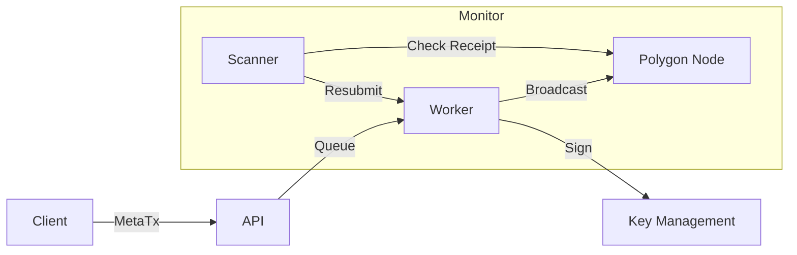

# Relayer Service 技术设计文档 (TDD)

## 1. 架构设计

## 2. 关键难点：Nonce 管理
以太坊要求每个账号的 Nonce 必须严格递增。
- **问题**: 如果并发发送 10 笔交易，Nonce 分别是 100-109。如果 100 卡住，101-109 都不会被打包。
- **解决方案**:
  - 使用 **Redis List** 作为一个内存互斥锁/队列。
  - 严格串行化同一个 Operator 地址的发送操作。
  - 或者维护多个 Operator 地址池 (Address Pool)，轮询使用，提高并发度。

## 3. 数据模型

### 3.1 Transactions
- `id`: uuid
- `tx_hash`: string (indexed)
- `from_address`: string (Operator)
- `target_contract`: string
- `nonce`: int
- `status`: PENDING | MINED | FAILED | REPLACED
- `gas_price`: bigInt
- `created_at`: timestamp

## 4. API 接口
- `POST /submit`: 提交交易请求。
- `GET /status/{task_id}`: 查询上链状态。
